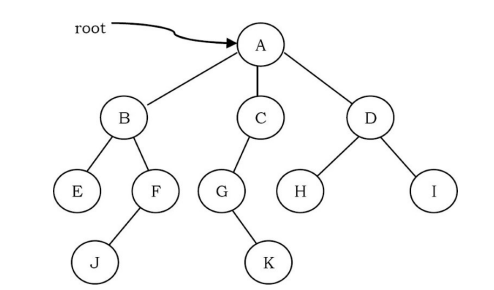
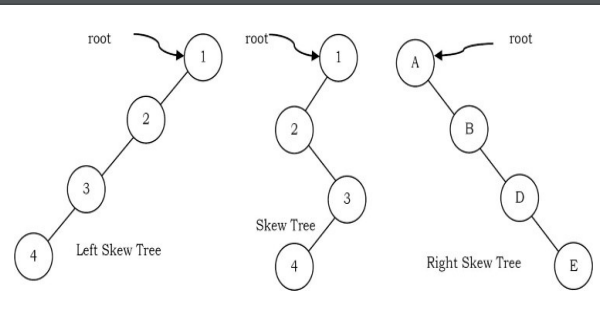
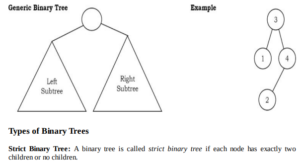
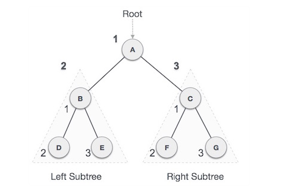
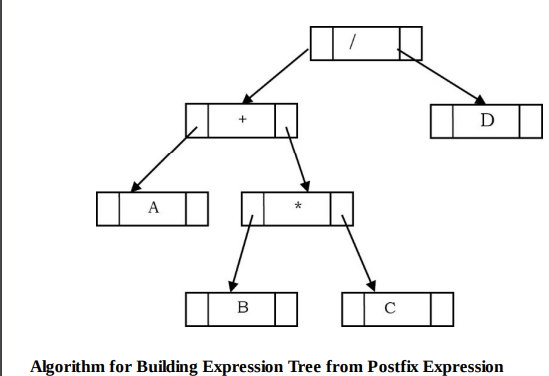
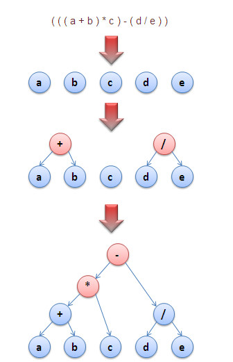

# dataStructures_Algorithms
##  1.Introduction 
### 1.1 Variables
In computer science programming we need something for holding data and 
*variables* is the way to do that. 
### 1.2 Data Types
System-defined data types: primitive data types
User-defined data.
### 1.3 Data Structure
Data structures:
_ Linear data structures:
_ Non-linear data structures. Tree and graphs

### 1.4 Abstract Data Types
Based on the discussion above, once we have data in variables, we need some 
mechanism for manipulating that data to solve problems.
ADTs: Declaration of data
      Declaration of operations.
Commonly use ADTs include:Linked Lists,Stacks, Queues, Priority Queues, Binary Trees,
Dictionaries, Disjoint Sets(Union and Find), Hash Tables, Graphs, and many others.

### 1.5 What is an Algorithm?
AN Algorithm is the step-by-step unambiguous to solve a given problem.

### 1.6 Why the Analysis of Algorithms.
To go from city "A" to city "B", there can be many ways of accomplishing this: by flight, by bus,..
and also by bicycle. Depending on the availability and convenience, we choose the one that suits.
Similarly, in computer science, multiple algorithms are available for solving the same problem.
Algorithm analysis helps us to determine which algorithm is most efficient in terms of time and space consumed

### 1.7 Goal of the Analysis of Algorithms
The goal of the analysis of algorithms is to compare algorithms (or solutions) mainly terms of running time but also in terms 
of other factors.

### 1.8 What is Running Time Analysis
It is process of determining how processing time increases as the size of the problem increases.
Common types of inputs:
_ Size of an array
_ Polynomial degree
_ NUmber of elements in a matrix
_ Number of bits in the binary representation of the input
_ Vertices and edges in a graph

### 1.9 How to Compare Algorithms 
Let us define a few objective measures:
_ Execution times
_ Number of statement executed
_ Ideal solution

### 1.10 What is Rate of Growth?
That rate at which the running time increases as a function of input is calle *Rate of Growth*

### 1.11  Commonly used Rates of Growth
Time complexity             Name
1                           Constant
log(n)                      Logarithmic
n                           Linear
nlog(n)                     Linear logarithmic
n^2                         Quadratic
n^3                         Cubic
2^n                         Exponential

Decreasing Rate of Growth:
2^(2^n) - n! - 4^n - 2^n - n^2 -nlog(n) - log(n!) - n - 2^(log(n)) - log(n)^2 -
Can bac hai log(n) - log (log(n)) -1

### 1.12 Types of Analysis
To analyze the given algorithm, we need to know with which inputs the algorithm takes less time (preforming well)
and with which inputs the algorithm takes a long time.
Worst case:
_ Defines the input for which the algorithm takes a long time(the slowest time to complete).
_ Input is the one for which the algorithms run the slowest.
Best case:
_ Defines the input for which the algorithm takes the least time(the fastest time to complete).
_ Input is the one for which the algorithm run the fastest.
Average case:
_ Provides a prediction about the running time of algorithm.
_ Assumes that the input is random
_ Run the algorithm many times

### 1.13 Asymptotic Notation
Having the expressions for the best, average and worst case, for all there case we need to identify
the upper and lower bounds.

### 1.14 Big-O Notation
This notation gives the tight upper bound of the given function.
f(n) = O(g(n)).
That means, at larger values of n, the upper bound of f(n) is g(n).

Big-O Visualization
No Uniqueness? there is no unique set of values for n0 and c is proving the asymptotic bounds.

### 1.15 Omega- Notation
Similar to the O discussion, this notation gives the tighter lower bound of the given algorithm, and we represent is
f(n) = Ω(g(n))

### 1.16 Theta-Θ Notation
This notation decides whether the upper and lower bounds of a given function (algorithm) are the same.

### 1.17 Important Notes
_ For analysis(best case, worst case and average), we try to give the upper bound(O) and lower bound() and average running time ().

### 1.18 Why is it called Asymptotic Analysis
In mathematics, we call such a curve an asymptotic curve. In other terms, g(n) is the asymptotic
curve for f(n). For this reason, we call algorithm analysis asymptotic analysis.

### 1.19 Guidelines for Asymptotic Analysis
1. Loops: The running time of a loop is, at most, the running time of the statements inside the loop multiplied by the number of iterations.
Total time = a constant cxn = cn = O(n)
2. Nested loops: Analyze from the inside out. Total running time is the product of the size of all the loops.
total time = cxnxn = cn^2= O(n^2). 
3. Consecutive statements: Add time complexities of each statement.
4. If-then-else statements: Worst-case running time: the test, plus either the then part or else part.
5. Logarithmic complexity: An algorithm is O(log(n)) if it takes a constant time to cut the problem size by a fraction (usually 1/2)
### 1.20 Simplifying properties of asymptotic notations
Transitivity: f(n)= Θ(g(n)) and  g(n) = Θ(h(n)) ⇒f(n) = Θ(h(n)).
Reflexivity: f(n) =  Θ(f(n))
Symmetry: f(n) = Θ(g(n))  if and only if g(n) = Θ(f(n))
Transpose symmetry: f(n) = O(g(n)) if and only if g(n) = Ω(f(n)).
If f(n) is in O(kg(n)) for any constant k > 0, then f(n) is in O(g(n))
If f1(n) is in O((g1(n))) and f2(n) is in O(g2(n)), then (f1+f2)(n) is in O(max(g1(n)),g1(n)).
If f1(n) iss in O((g1(n))) and f2(n) is in O(g2(n)) then (f1+f2)(n) is in O(max(g1(n)g1(n))).

### 1.21 Commonly used Logarithms and Summations

Logarithms:


Arithmetic series:


Geometric series


Harmonic series:


Other important formulae


## Question pre
1. What is the rate of growth?
   That rate at which the running time increases as a function of input is calle *Rate of Growth*

2. Type of analysis?
   It has three type of analysis: 
   _ Worst case.
   _ Best case.
   _ Average case.
   
3. What is the big O notation?
   Big-O notation is  gives the tight upper bound of the give function.
4. Asymptotic analysis
_ Total time of a loop?
   The running time of a loop is, at most, the running time of the statements inside the loop multiplied by the number of iterations.

_ Total time of nested loop?
   Analyze from the inside out. Total running time is the product of the size of all the loops.
_ Total time for consecutive statements?
   Add time complexities of each statement.
_ Total time for if then else statement?
   Worst-case running time: the test, plus either the then part or else part.
5. Identify O(?)of the F(n) = 5n4 +3n^3 + 2n^2+4n +1
O(n^4), c=6, n>2.
6. ------------------- F(n) = 5n2 +3nlog(n)+ 2n +5
O(n^2), c= 6, n>1.
7. ------------------- F(n) = 3log(n) +2.
O(log(n)), c= 3, n>1.
8. Find the complexity of the function give blow.
   ````java
   int sum = 0
   for(int n = N;n>0;n/=2)
        for(int i=0; i<n;i++)
            sum++;
   O(nlog(n)), c
9. Find the complexity of the function give blow.
    ````java
   int sum = 0
   for(int n = 1;n<N;n*=2)
        for(int i=0; i<n;i++)
            sum++;
   O(nlog(n))
   

## 2.Sorting
### 2.1 Classification of Sorting Algorithm 
   Sorting algorithms are generally categorized based on the following parameters.
#### By Number of comparisons    
   Best case: O(nlog(n))
   Wort case: O(n^2).
#### By Number of Swaps
#### By Memory Usage
#### By stability
#### By Adaptability
#### Other Classification
   Internal short
   External short
   
#### 3. Linked list
1. Singly Linked Lists
## 4.Stacks
### 4.1 What is stack?
_ A stack is simple data structure used for storing data(similar or Linked Lists).
A stack is an ordered list in which insertion and deletion are done at on end, called top.
### 4.2 How stacks are used?
Stacks are used to implement functions, parsers, expression evaluation, and backtracking algorithms.
### 4.3 Implementation
There are many ways of implementing stack ADT:
_ Simple array based implementation.
_ Dynamic array based implementation.
_ Linked lists implementation.

#### 4.3.1 Simple array based implementation
This implementation of stack ADT uses an array. In the array, we add elements from left to right and use a variable to keep 
track of the index of the top element. 
#### 4.3.2 Dynamic Array Implementation
First, let's consider how we implemented a simple array based stack. We took one index variable top which points to the index 
of the most recently inserted element in the stack. To insert(or push) an element,we increment top index and the place the 
new element at that index.

Similarly, to delete( or pop) an element we take the element at top index and then decrement the top index. We represent
an empty queue with top value equal to -1. The issue that still needs to be resolved is what we do when all the slots in 
the fixed size array stack are occupied.
##### Problems with this approach?
This way of incrementing the array size is too expensive. Let us see the reason for this. 
For example, at n=1, to push an element create a new array of size 2 and copy all the old array elements to the new array
and at the end add the new element. 
Similarly, at n=n-1, if we want to push an element create a new array of size n and copy all the old array elements to new 
array and at the end add the new element. After n push operations the total time T(n) is proportional to 1+2+..n. 0(n^2)

##### Alternative Approach: Repeated doubling
Let us improve the complexity by using the array doubling technique. If the array is full, create a new array of twice the size 
, and copy the items. With this approach, pushing n items takes time proportional to n (not n^2)

For simplicity, let us assume that initially we started with n= 1 and moved up to n = 32. That mean, we do the doubling at 
1,2,4,8, 16. The other way of analyzing the same approach is: at n =1. If we want to add an element, double the current 
size of the array and copy all the element of the old array to the new array.

#### Linked list Implementation 
The other way of implementing stacks is by using Linked lists. Push operation is implemented by inserting element at the 
beginning of the list. Pop operation is implemented by deleting the node from the beginning(the header/top node)
### 4.4 Comparison of Stack Implementations between array & linked list
_ Cấu trúc:
Array  được xây dựng trên chỉ mục, ở đó mỗi phần tử trong mảng được gắn với một chỉ mục cố định.
Trước khi truy xuất 1 phần tử cần biết được index của nó. Index có thể bắt đầu từ 0 và 1 tùy vào từng ngôn ngữ lập trình.

Linkedlist: Các phần tủ được liên kết theo thứ tự, chúng liên kết kết theo thứ tự. Muốn truy xuất một phần tử dữ liệu 
trong thì cần tìm đến các phần từ liền kề của nó. 

_ kích thước:
Array: yêu cầu một kích thước cố định trong quá trình khai báo, khi số lượng vượt quá kích thước cần resize.
Linkedlist: Danh sách liên kết không gặp bất cứ vấn đề gì về kích thước, chúng linh hoạt trong việc thay đổi kích thước.

_ Bộ nhớ:
LinkedList: yêu cầu bộ nhớ nhiều hơn do một một lượng bộ nhớ để lưu đến phần tử tham chiếu
Array: yêu cầu trong quá trình biên dịch. Lưu vị trí liền kề Stack
Linkedlist: yêu cầu bộ nhớ quá trình chạy. Lưu vị trí ngẫu nhiên Heap.

_ Truy xuất:
 Mảng nhanh hơn và đơn giản so với lionkedlist
Arrays: 0(1)
LinkedList: 0(n)

_ Thêm và xóa:
LinkedList: nhanh hơn.

Ưu điểm của linkedlist so với array: kích thước linh hoạt, dễ dàng thêm và xóa phần tử, không yêu cầu cấp phát trước bộ nhớ.
Ưu điểm của arrays: truy xuất ngẫu nhiên, lượng bộ nhớ yêu cầu thấp, dễ thực thi và sửa dụng.

Array Implementation
• Operations take constant time.
• Expensive doubling operation every once in a while.
• Any sequence of n operations (starting from empty stack) - “amortized” bound takes
time proportional to n.
Linked List Implementation
• Grows and shrinks gracefully.
• Every operation takes constant time O(1).
• Every operation uses extra space and time to deal with references.


### 5.1 What is queue?
A queue is a data structure for storing data(similar to linked Lists and Stacks). 
In queue, the order in which data arrives is important. 
In general, a queue is a line of people or things waiting to be served in sequential order starting at the
beginning of the line or sequence.

### 5.2 How queue are used?
The concept of a queue can be explained by observing a line at a reservation counter.
When we enter the line we stand ar the end of the line and the person who is at the front of the line is the one who will
be served next. He will exit the queue and be served.
### 5.3 Comparison of Queue Implementations between array & linked list.
Array Implementation
• Operations take constant time.
• Expensive doubling operation every once in a while.
• Any sequence of n operations (starting from empty stack) - “amortized” bound takes
time proportional to n.
Queue Implementation
• Grows and shrinks gracefully.
• Every operation takes constant time O(1).
• Every operation uses extra space and time to deal with references.

## Tree
### What is tree
Binary trees - Cây nhị phân là một cấu trúc trong đó mỗi nút(giao điểm) có thể có nhiều nhất hai nhánh con(hai giao điểm)
Trong cây nhị phân, tồn tại một con dường dẫn duy nhất từ nút gốc đến mọi nút khác. Nút trên cùng của cây nhị phân được 
được gọi là nút gốc hoặc nút cha và các nút đến từ nút gốc được gọi là nút con.
Nhánh cuối gọi là nhánh lá.

A tree is a data structure similar to a linked list but instead of each pointing simply to the next node linear fashion
,each node point to a number of nodes.

### Glossary


      Root of a tree: is the node with no parents.  (Just only one root in a tree)
      An edge : refers to the link child.
      Leaf node: A node with no children.
      Siblings: Children(node) same parent.
      Ancestor: a node 'p' is an ancestor of node 'q'. If the exists a path from root to q and p appears on the path
      the node q is descendant of node p.
      The level of the tree: set of all nodes  at  given depth. That root node is at the level zero.
      The depth: is the length of the path from the root to the node.
      The hight: is the length of the path from that node to the deepest node.
      The hight of tree: is the maximum height among all the nodes in the tree and depth of the tree
      Skew trees: every node in a tree has only one child (except leaf node).
      Left shew tree: node has only left child
      RIght skew tree: node has only right child
   
   
### Binary Trees:


#### Type of Binary Trees:
_ Strict Binary Tree: is each node has exactly two children or no children.
_ Full Binary Tree: each node has exactly two children  and all leaf nodes at same level.
_ Complete Binary Tree: Let us assume that th height of the binary tree is h.
                        A binary tree is called complete  binary tree if all leaf node are at height h or h-1 and also 
                        without any missing number in the sequence.

#### Basic Operations 
_ Insert an element into a tree.
_ Deleting an element from a tree.
_ Searching for an element.
_ Traversing the tree.

#### Auxiliary Operations
_ Finding the size of the tree.
_ Finding the height of the tree.
_ Finding the level which has maximum sum.
_ Finding the least common ancestor(LCA) for a given pair of nodes, and many more.

#### InOrder Traversal
In Inorder traversal the root is visited between the subtrees. Inorder traversal is defined as follows:
_ Traverse the left subtree in Inorder.
_ Visit the root.
_ Traverse the right subtree inorder.


A → B → D → E → C → F → G
#### Expression tree.
A tree representing an expression is called an expression tree. In expression trees, leaf nodes are operands and non-leaf 
nodes are operators


Cách hoạt động
